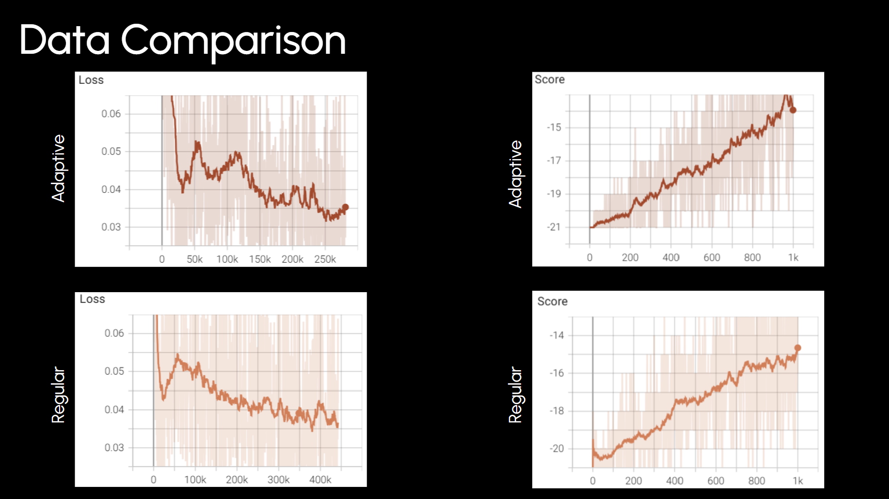

# Pong DQN with Reward-Adaptive Exploration

A Double DQN agent that learns to play Atari Pong from raw pixels, with a
reward-scaled epsilon schedule that adapts exploration to recent performance
instead of decaying on a fixed schedule.

## Results

Two agents were trained for 1000 episodes each, identical in every way
except the epsilon schedule:

| | Final score (10-ep avg) | Total env steps |
|---|---|---|
| **Adaptive schedule** | ~-6 | ~275k |
| **Fixed decay schedule** | ~-15 | ~450k |



The adaptive schedule reaches a substantially higher score in fewer
environment steps. It also terminates episodes faster once it starts
winning points, which is why it logs fewer total steps for the same
1000 episodes — a useful side signal that it's actually playing better,
not just exploring less.

Neither run has fully solved Pong (0 = draw, 21 = perfect game) at the
1000-episode mark; both are still trending upward. The comparison here is
about the exploration strategy, not a claim of full convergence.


## Why an adaptive epsilon schedule

Standard DQN implementations decay epsilon on a fixed linear or exponential
schedule regardless of how training is actually going. This project instead
scales the epsilon multiplier off a rolling 10-episode average reward:

- **When the smoothed average is poor** (below a threshold), epsilon is
  scaled by a function that can exceed 1x, boosting exploration when the
  agent appears stuck.
- **When performance is acceptable**, epsilon decays gently and
  monotonically.

Both functions are smooth (not step functions) so the exploration rate
moves proportionally to how far off-target performance is, rather than
jumping between two fixed decay rates.

## Architecture

- **Algorithm**: Double DQN with soft target updates
- **Input**: 4 stacked grayscale frames (64x64), so the network can infer
  motion/velocity rather than seeing only a static frame
- **Network**: 3 conv layers -> 3 fully-connected layers -> Q-values per
  action
- **Replay buffer**: 500k transitions, uniform sampling
- **Frame skip**: actions repeated for 4 environment steps (`step_repeat`)

## Project structure

```
agent.py       # Training and evaluation loops
model.py       # Q-network architecture
buffer.py      # Replay buffer
eps_funcs.py   # Adaptive epsilon scaling functions
train.py       # Entry point for training
test.py        # Entry point for watching a trained agent play
```

## Setup

```bash
pip install gymnasium[atari,accept-rom-license] torch tensorboard
```

## Usage

Train:
```bash
python3 train.py
```

Watch a trained agent play (loads `models/latest.pt`):
```bash
python3 test.py
```

Monitor training live:
```bash
tensorboard --logdir runs
```

## Notes / possible extensions

- Prioritized experience replay
- Dueling network architecture
- Longer training runs to reach positive (winning) scores
- Ablation across more epsilon-schedule variants
